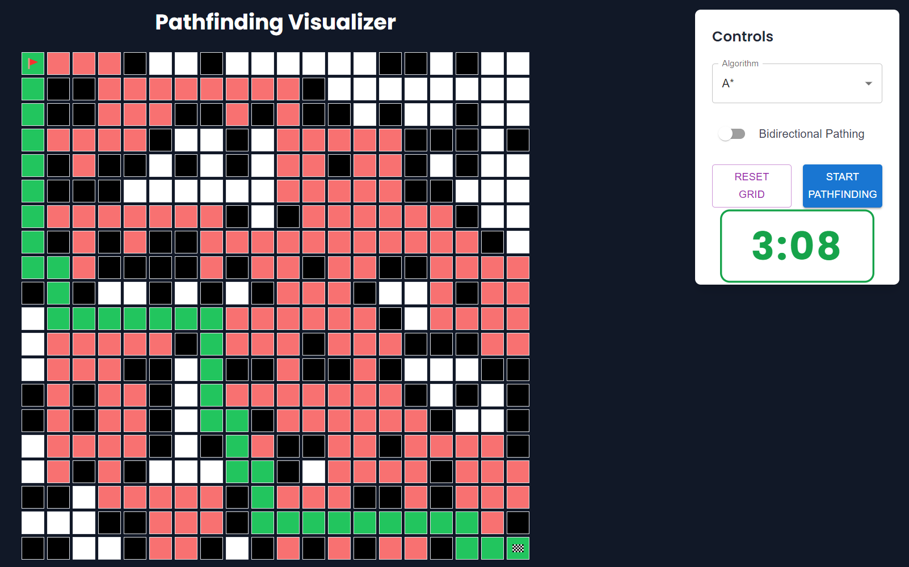

# 🚀 Pathfinding Visualizer

Welcome to my **Pathfinding Visualizer** – an interactive tool designed to dynamically showcase popular pathfinding
algorithms in action. This project is ideal for learning and demonstrating how various search algorithms navigate
through grids to find the shortest path.

## ✨ Features

- 🎯 **Visualize** pathfinding algorithms in real-time.
- 🔄 **Bidirectional Pathing** – Speed up search by enabling bidirectional search.
- 🎨 **Responsive UI** – Sleek and intuitive interface using Material-UI and Tailwind CSS.
- ⏱️ **Timer** – Track how long each algorithm takes to compute the path.

## 📸 Preview



---

## ⚙️ Algorithms Included

- 🔵 **Breadth-First Search (BFS)** – Unweighted, guarantees shortest path.
- 🟢 **Depth-First Search (DFS)** – Unweighted, does not guarantee shortest path.
- 🟡 **Dijkstra's Algorithm** – Weighted, guarantees shortest path.
- 🔴 **A*** – Weighted, heuristic-based pathfinding.
- 🔄 **Bidirectional Versions** – Available for all algorithms to boost performance.

---

## 🚧 How It Works

- **Select** an algorithm from the dropdown.
- **Enable** the bidirectional switch (optional).
- **Start Pathfinding** – Visualize the algorithm finding the shortest path.
- **Reset Grid** to try another algorithm.

---

## 🛠️ Installation

```bash
# Clone the repository
git clone git@github.com:David-Rodden/pathfinder-visualizer.git

# Navigate to the project directory
cd pathfinding-visualizer

# Install dependencies
npm install

# Run the development server
npm run dev
```

---

## 🎨 Customization

Want to tweak the visualizer to your liking? Here are a few quick tips:

- **Grid Size**  
  Modify the grid size by adjusting the `GRID_SIZE` variable in `Grid.tsx`.
  ```
  const GRID_SIZE = 20;  // Change this to resize the grid
  ```

- **Obstacle Density**  
  Customize the obstacle generation by tweaking the `Math.random()` threshold in `generateGrid()`.
  ```
  const newGrid: TileType[][] = Array.from({ length: GRID_SIZE }, () =>
      Array.from({ length: GRID_SIZE }, () => (Math.random() < 0.3 ? 'blocked' : 'free')),
  );
  ```
  Lowering the value reduces obstacles, while raising it creates denser grids.

- **Algorithm Defaults**  
  Set the default algorithm by modifying the state in `Home.tsx`:
  ```
  const [algorithm, setAlgorithm] = useState<AlgorithmType>('bfs');
  ```